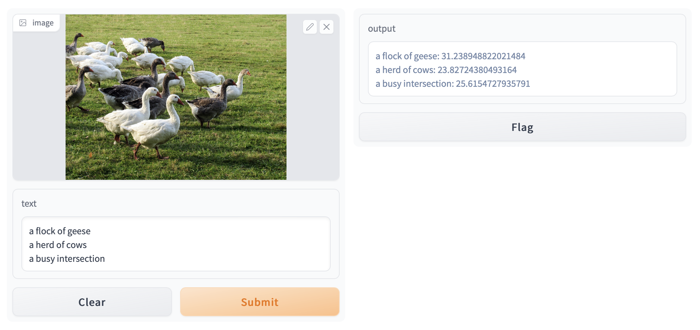

# CLIP Explorer

This is a [Gradio](https://gradio.app) app for quickly trying our similarity scores for image-text pairs. Simply run the app and open your browser:

```sh
# install dependencies
pip3 install --upgrade -r requirements.txt

# run app
python3 main.py

# you'll be prompted to open your browser in just a moment
```

Now, you can provide an image and multiple lines of text to compute a similarity score for!


